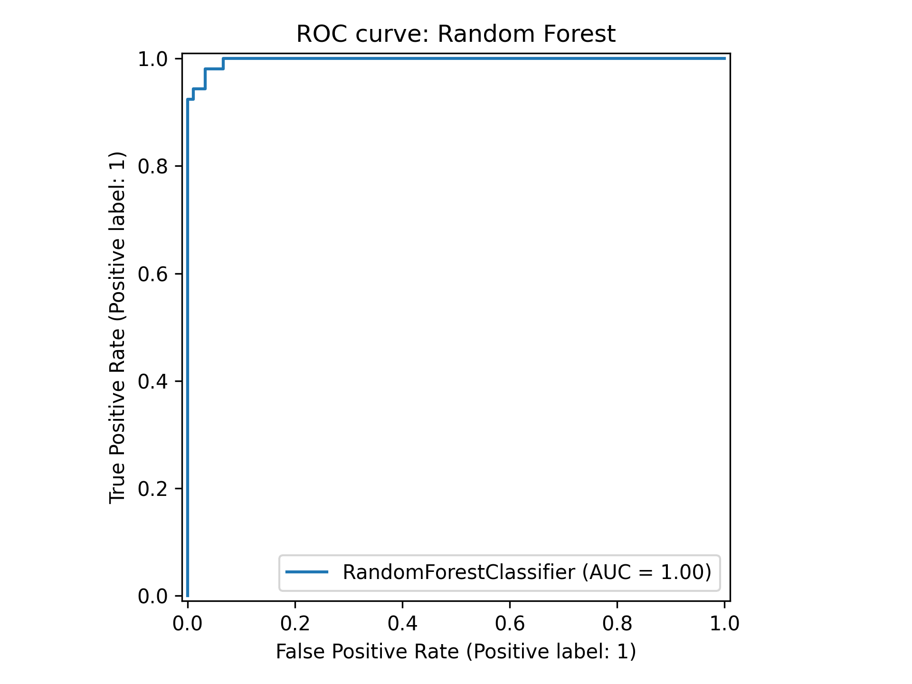
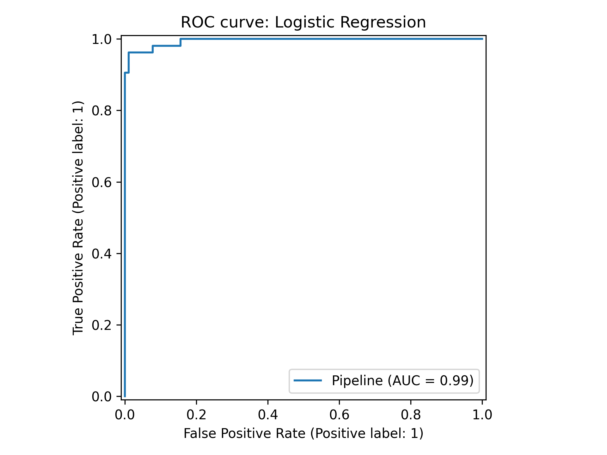
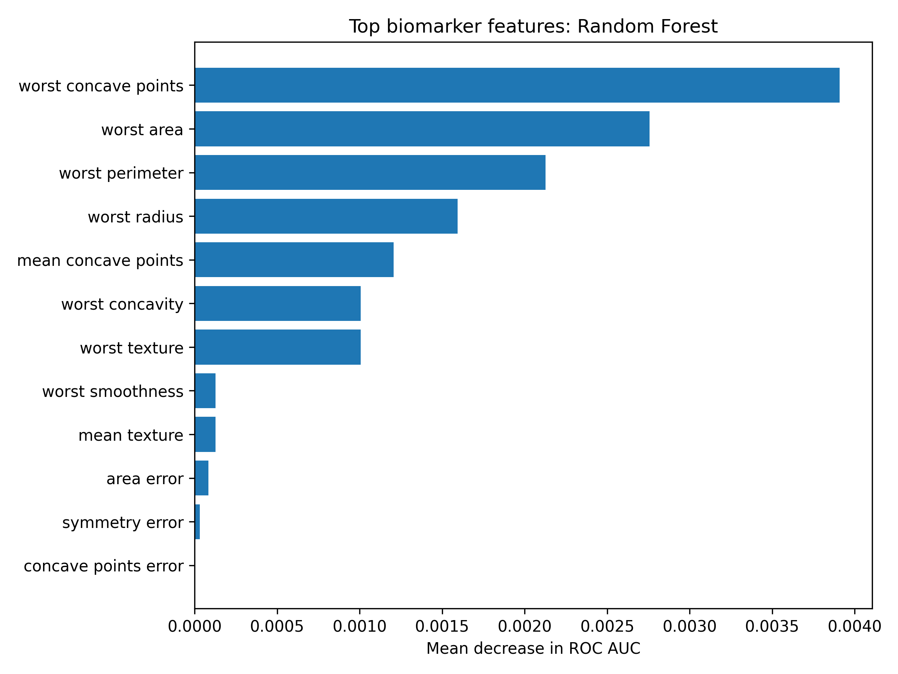
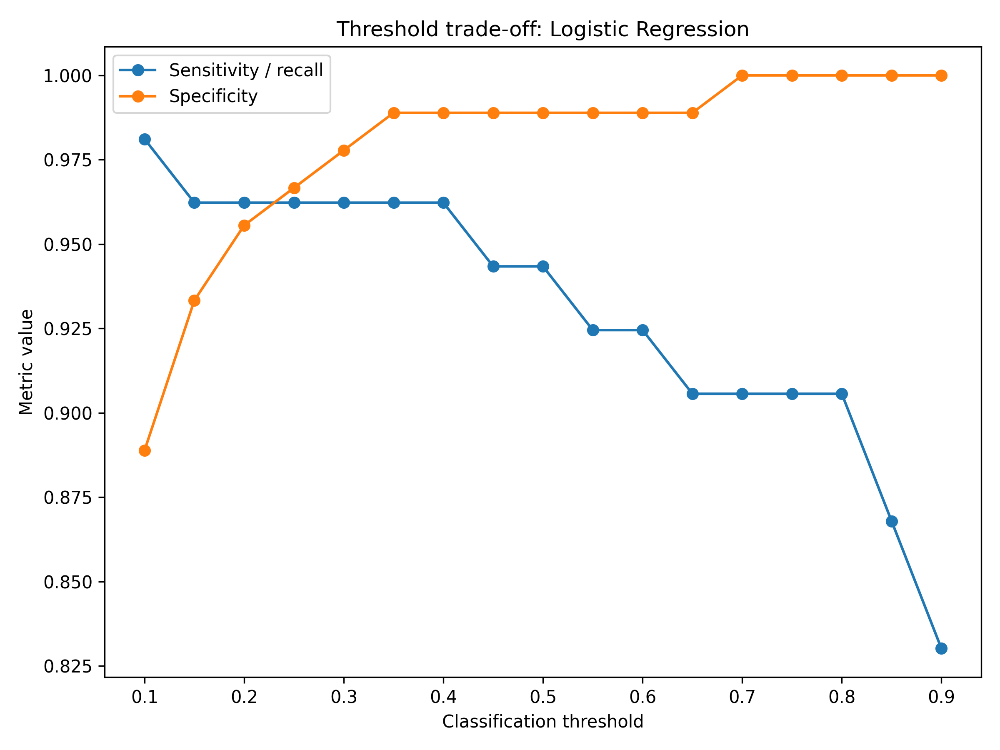
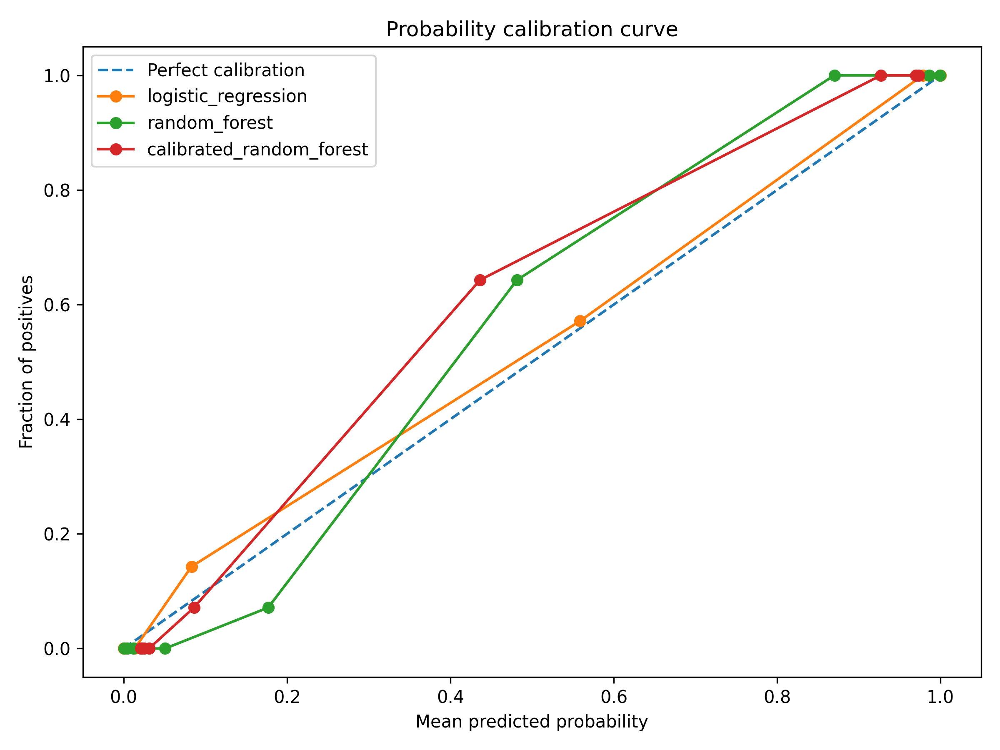

# Clinical Biomarker ML Pipeline

A reproducible Python machine-learning project for binary biomarker classification using a public breast cancer diagnostic dataset.

## Project summary

This project builds a complete machine-learning workflow for classifying malignant versus benign tumour samples using biomarker-style diagnostic features.

The pipeline includes data loading, train-test splitting, stratified cross-validation, model comparison, ROC-AUC evaluation, confusion matrices, threshold analysis, probability calibration, feature-importance analysis, model export, automated tests and GitHub Actions checks.

The project demonstrates practical Python, scikit-learn, biomedical data science, reproducible machine-learning workflow design and cautious interpretation of clinical-style ML outputs (Pedregosa et al., 2011).

## Key result

Both models achieved strong held-out test performance on the Breast Cancer Wisconsin Diagnostic dataset (Wolberg et al., 1993).

| Model | CV ROC-AUC mean | Test ROC-AUC | Test accuracy | Test precision | Test recall | Test F1 |
|---|---:|---:|---:|---:|---:|---:|
| Random forest | 0.9866 | 0.9973 | 0.9650 | 0.9800 | 0.9245 | 0.9515 |
| Logistic regression | 0.9906 | 0.9950 | 0.9720 | 0.9804 | 0.9434 | 0.9615 |

Logistic regression achieved slightly higher accuracy, recall and F1 score, while random forest achieved slightly higher ROC-AUC.

Because this is a clean benchmark dataset, these results should be interpreted as evidence of a working machine-learning workflow rather than evidence of real-world clinical readiness.

## Main result figures

### Random forest ROC curve



### Logistic regression ROC curve



### Random forest feature importance



### Logistic regression threshold trade-off



### Probability calibration curve



## Important interpretation boundary

This is an educational machine-learning pipeline using a public benchmark dataset. It is not a clinical diagnostic tool and should not be interpreted as medical advice or validated clinical software.

The purpose is to demonstrate reproducible biomedical ML workflow design, model evaluation, threshold reasoning, calibration analysis and cautious interpretation.

## Dataset

The project uses the Breast Cancer Wisconsin Diagnostic dataset, accessed through `sklearn.datasets.load_breast_cancer` (Wolberg et al., 1993; Pedregosa et al., 2011).

The original dataset labels are recoded so that:

- `1` = malignant
- `0` = benign

This makes malignant disease the positive class for model evaluation.

## Models compared

Two classification models are compared: logistic regression, a standard approach for binary outcome modelling (Cox, 1958), and random forest, an ensemble tree-based method introduced by Breiman (2001).

The implemented models are:

- logistic regression with standardisation and class balancing
- random forest classifier with class balancing
- calibrated random forest for probability calibration analysis

## Clinical threshold analysis

ROC-AUC measures ranking ability, but clinical-style decisions require a probability threshold.

This project therefore includes a threshold analysis from 0.10 to 0.90. For each threshold, the pipeline reports:

- sensitivity / recall
- specificity
- precision
- F1 score
- false positives
- false negatives

In a screening-style context, false negatives may be more harmful than false positives because missing malignant disease could delay diagnosis. The threshold analysis therefore makes the trade-off between sensitivity and specificity explicit rather than relying only on accuracy or ROC-AUC.

The threshold analysis output is saved in:

`results/threshold_analysis.csv`

A selected clinically cautious threshold summary is saved in:

`results/selected_threshold_summary.csv`

## Probability calibration

High ROC-AUC does not guarantee that predicted probabilities are clinically meaningful.

This project therefore includes a probability calibration analysis using calibration curves and Brier scores. This helps distinguish between a model that ranks samples well and a model whose predicted probabilities are numerically reliable.

The calibration summary is saved in:

`results/calibration_summary.csv`

The calibration curve is saved in:

`figures/calibration_curve.png`

## Key outputs

| Output | Location |
|---|---|
| Model performance summary | `results/model_performance_summary.csv` |
| Logistic regression confusion matrix | `results/logistic_regression_confusion_matrix.csv` |
| Random forest confusion matrix | `results/random_forest_confusion_matrix.csv` |
| Feature importance table | `results/random_forest_permutation_importance.csv` |
| Threshold analysis | `results/threshold_analysis.csv` |
| Selected threshold summary | `results/selected_threshold_summary.csv` |
| Calibration summary | `results/calibration_summary.csv` |
| ROC curve plots | `figures/` |
| Threshold trade-off plot | `figures/logistic_regression_threshold_tradeoff.png` |
| Calibration curve | `figures/calibration_curve.png` |
| Saved models | `models/` |
| Model card | `MODEL_CARD.md` |
| Automated tests | `tests/test_pipeline.py` |
| GitHub Actions workflow | `.github/workflows/python-checks.yml` |

## Skills demonstrated

- Python programming
- biomedical machine learning
- scikit-learn model building
- train-test splitting
- stratified cross-validation
- ROC-AUC evaluation
- confusion matrix interpretation
- precision, recall and F1 score interpretation
- threshold trade-off analysis
- probability calibration
- Brier score interpretation
- feature importance analysis
- model export using `joblib`
- automated testing with `pytest`
- GitHub Actions workflow checks
- reproducible project organisation
- scientific caution around clinical ML claims

## Repository structure

```text
data/                    Processed dataset export
figures/                 ROC curves, threshold plots and calibration plots
models/                  Saved trained models
results/                 Model metrics, metadata, threshold and calibration outputs
scripts/                 Python analysis scripts
tests/                   Automated project tests
.github/workflows/       GitHub Actions workflow
```

## Reproducibility

Install dependencies:

```powershell
python -m pip install -r requirements.txt
```

Run the full analysis:

```powershell
python scripts/run_pipeline.py
python scripts/threshold_analysis.py
python scripts/calibration_analysis.py
```

Run tests:

```powershell
python -m pytest -q
```

## Responsible ML note

This project includes a `MODEL_CARD.md` file to describe intended use, non-intended use, model limitations and clinical interpretation boundaries.

This is important because biomedical ML projects should not only optimise model performance. They should also make model assumptions, risks and limitations explicit.

## Limitations

This project uses a clean public benchmark dataset rather than raw hospital, clinical trial or external validation data.

The model has not been externally validated, prospectively tested or assessed for deployment in real clinical settings.

The feature importance results are useful for model interpretation, but they should not be treated as causal biological evidence.

The high performance metrics partly reflect the structured nature of the benchmark dataset and should not be overgeneralised to messy real-world clinical data.

The project currently demonstrates internal validation and workflow design. A stronger future version would test generalisability using an independent external dataset.

## Conclusion

This project demonstrates a complete biomedical machine-learning workflow using Python and scikit-learn.

It goes beyond simple model fitting by adding threshold analysis, probability calibration, automated tests, GitHub Actions checks and a model card.

The repository shows practical ability to build, evaluate, interpret and organise a reproducible ML pipeline while maintaining appropriate caution around clinical claims.

## References

Breiman, L. (2001) ‘Random Forests’, *Machine Learning*, 45(1), pp. 5–32. doi: 10.1023/A:1010933404324.

Cox, D.R. (1958) ‘The regression analysis of binary sequences’, *Journal of the Royal Statistical Society: Series B*, 20(2), pp. 215–242.

Pedregosa, F. et al. (2011) ‘Scikit-learn: Machine learning in Python’, *Journal of Machine Learning Research*, 12, pp. 2825–2830.

Wolberg, W., Mangasarian, O., Street, N. and Street, W. (1993) *Breast Cancer Wisconsin (Diagnostic)*. UCI Machine Learning Repository. doi: 10.24432/C5DW2B.